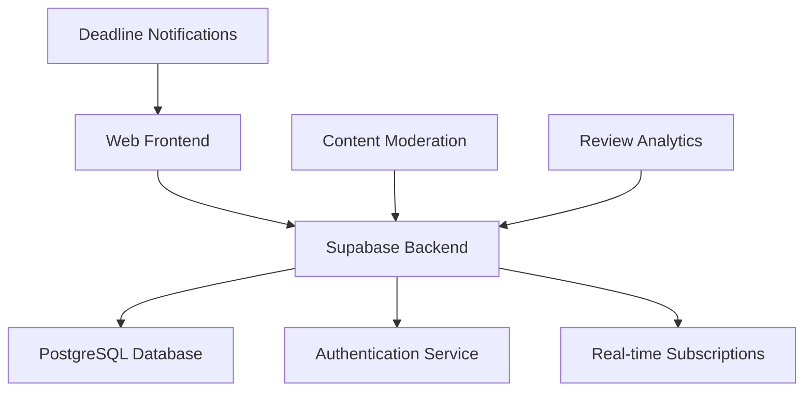

# Design Document

## Overview

The Student Opportunity Platform is a web-based application that provides TUM students with transparent, peer-reviewed information about internships, extracurricular programs, and academic opportunities. The platform follows a minimalist, information-first design philosophy inspired by Hacker News, prioritizing quick scanning and actionable data over visual polish.

The system builds upon the existing vorpraktika.de foundation, expanding from a simple review platform to a comprehensive opportunity discovery tool with structured data, barrier classification, and intelligent filtering.

## Architecture

### High-Level Architecture



### Technology Stack

**Frontend:**
- Vanilla JavaScript (maintaining current simplicity)
- CSS3 with responsive design
- Progressive Web App (PWA) capabilities for mobile-first experience
- No heavy frameworks to maintain fast loading times

**Backend:**
- Supabase (PostgreSQL + Auth + Real-time + Edge Functions)
- Row Level Security (RLS) for data access control
- Edge Functions for content moderation and analytics

**Infrastructure:**
- Vercel for static hosting and edge deployment
- Supabase for database and backend services
- CDN for static assets

### Design Principles

1. **Information First**: Content and functionality over visual design
2. **Mobile First**: Optimized for mobile consumption between classes
3. **Scannable**: Users should extract value within 10 seconds
4. **Minimal Friction**: No mandatory registration for browsing
5. **Transparent**: Honest, unfiltered peer feedback

## Components and Interfaces

### Core Components

#### 1. Opportunity List Component
```javascript
// Main table displaying opportunities with sortable columns
OpportunityList {
  - filters: { program, semester, barrier, type, deadline }
  - sorting: { field, direction }
  - pagination: { page, limit }
  - displayMode: 'table' | 'cards'
}
```

**Key Features:**
- Sortable columns: Deadline, Barrier Level, Payment, Relevance Score
- Color-coded urgency indicators for deadlines
- Expandable rows for quick preview of reviews
- Infinite scroll or pagination for performance

#### 2. Opportunity Detail Component
```javascript
OpportunityDetail {
  - opportunity: OpportunityData
  - reviews: ReviewData[]
  - aggregatedStats: { avgRating, totalReviews, recommendationRate }
  - relatedOpportunities: OpportunityData[]
}
```

**Key Features:**
- Structured opportunity information (company, requirements, timeline)
- Peer review aggregation with sentiment analysis
- Quick action buttons (Apply, Save, Share)
- Related opportunities based on tags and program

#### 3. Review Submission Component
```javascript
ReviewSubmission {
  - opportunityId: string
  - reviewTemplate: StructuredReviewFields
  - validation: ReviewValidationRules
  - moderation: ContentModerationFlags
}
```

**Structured Review Template:**
- What did you expect? (text)
- What actually happened? (text)
- Would you recommend this? (yes/no/maybe)
- Hours per week commitment (number)
- Skills gained vs. advertised (rating 1-5)
- Barrier level assessment (Low/Medium/High)
- Tags (predefined + custom)

#### 4. Filter and Search Component
```javascript
FilterSystem {
  - programFilter: StudyProgram[]
  - semesterFilter: number
  - barrierFilter: 'Low' | 'Medium' | 'High'
  - typeFilter: 'Internship' | 'Event' | 'Club' | 'Course'
  - deadlineFilter: DateRange
  - paymentFilter: 'Paid' | 'Unpaid' | 'Both'
}
```

#### 5. Survival Kit Component
```javascript
SurvivalKit {
  - semester: number
  - program: StudyProgram
  - urgentDeadlines: OpportunityData[]
  - recommendedActions: ActionItem[]
  - timelineView: SemesterTimeline
}
```

### Data Models

#### Opportunity Model
```sql
CREATE TABLE opportunities (
    id uuid PRIMARY KEY DEFAULT gen_random_uuid(),
    created_at timestamp with time zone DEFAULT now(),
    updated_at timestamp with time zone DEFAULT now(),
    
    -- Basic Information
    title text NOT NULL,
    company text NOT NULL,
    website text,
    description text,
    
    -- Classification
    type text NOT NULL CHECK (type IN ('internship', 'event', 'club', 'course', 'mentorship')),
    barrier_level text NOT NULL CHECK (barrier_level IN ('Low', 'Medium', 'High')),
    study_programs text[], -- ['Maschinenwesen', 'Aerospace', 'Informatik']
    min_semester integer,
    max_semester integer,
    
    -- Practical Details
    is_paid boolean,
    duration_weeks integer,
    hours_per_week integer,
    location text,
    remote_possible boolean,
    
    -- Timeline
    application_deadline date,
    start_date date,
    end_date date,
    
    -- Metadata
    tags text[],
    requirements text[],
    skills_gained text[],
    
    -- Aggregated Data
    total_reviews integer DEFAULT 0,
    avg_rating numeric(3,2),
    recommendation_rate numeric(3,2),
    
    -- Moderation
    is_verified boolean DEFAULT false,
    is_active boolean DEFAULT true
);
```

#### Enhanced Review Model
```sql
CREATE TABLE reviews (
    id uuid PRIMARY KEY DEFAULT gen_random_uuid(),
    created_at timestamp with time zone DEFAULT now(),
    user_id uuid REFERENCES auth.users(id) ON DELETE SET NULL,
    opportunity_id uuid REFERENCES opportunities(id) ON DELETE CASCADE,
    
    -- Reviewer Context
    reviewer_name text,
    reviewer_program text,
    reviewer_semester integer,
    
    -- Structured Review Data
    expectation text NOT NULL,
    reality text NOT NULL,
    would_recommend text NOT NULL CHECK (would_recommend IN ('yes', 'no', 'maybe')),
    hours_per_week integer,
    skills_rating integer CHECK (skills_rating BETWEEN 1 AND 5),
    
    -- Assessment
    barrier_assessment text CHECK (barrier_assessment IN ('Low', 'Medium', 'High')),
    tags text[],
    
    -- Engagement
    upvotes integer DEFAULT 0,
    helpful_count integer DEFAULT 0,
    
    -- Moderation
    is_verified boolean DEFAULT false,
    moderation_status text DEFAULT 'pending' CHECK (moderation_status IN ('pending', 'approved', 'flagged', 'rejected'))
);
```

#### User Preferences Model
```sql
CREATE TABLE user_preferences (
    user_id uuid PRIMARY KEY REFERENCES auth.users(id) ON DELETE CASCADE,
    study_program text,
    current_semester integer,
    interested_tags text[],
    notification_preferences jsonb,
    saved_opportunities uuid[],
    created_at timestamp with time zone DEFAULT now()
);
```

## Error Handling

### Client-Side Error Handling

1. **Network Errors**: Graceful degradation with cached data and retry mechanisms
2. **Validation Errors**: Real-time form validation with clear error messages
3. **Authentication Errors**: Seamless fallback to anonymous browsing
4. **Loading States**: Skeleton screens and progressive loading

### Server-Side Error Handling

1. **Database Errors**: Automatic retry with exponential backoff
2. **Rate Limiting**: Implement per-IP and per-user rate limits
3. **Content Moderation**: Automatic flagging with manual review queue
4. **Data Integrity**: Comprehensive validation and sanitization

### Error Recovery Strategies

```javascript
// Example error boundary for opportunity loading
class OpportunityErrorBoundary {
  handleError(error) {
    if (error.type === 'NETWORK_ERROR') {
      return this.showCachedData();
    }
    if (error.type === 'VALIDATION_ERROR') {
      return this.showValidationMessages();
    }
    return this.showGenericError();
  }
}
```

## Testing Strategy

### Unit Testing
- **Components**: Test individual React-like components in isolation
- **Utilities**: Test filtering, sorting, and data transformation functions
- **API Integration**: Mock Supabase calls and test error scenarios
- **Validation**: Test form validation and data sanitization

### Integration Testing
- **User Flows**: Test complete user journeys (browse → filter → review → submit)
- **Database Operations**: Test CRUD operations with real Supabase instance
- **Authentication**: Test anonymous and authenticated user experiences
- **Real-time Updates**: Test live updates for new reviews and opportunities

### End-to-End Testing
- **Critical Paths**: Test opportunity discovery and review submission flows
- **Mobile Experience**: Test responsive design and touch interactions
- **Performance**: Test loading times and data fetching efficiency
- **Accessibility**: Test keyboard navigation and screen reader compatibility

### Performance Testing
- **Load Testing**: Simulate concurrent users browsing and submitting reviews
- **Database Performance**: Test query performance with large datasets
- **Mobile Performance**: Test on various devices and network conditions
- **Caching Strategy**: Test edge caching and data freshness

### Content Quality Testing
- **Review Quality**: Test moderation algorithms and manual review processes
- **Data Accuracy**: Validate opportunity information and deadline tracking
- **Search Relevance**: Test filtering and sorting accuracy
- **Spam Detection**: Test automated content moderation systems

## Security Considerations

### Data Protection
- **Personal Information**: Minimize collection, encrypt sensitive data
- **Review Anonymization**: Option for anonymous reviews with pseudonyms
- **GDPR Compliance**: Right to deletion and data portability
- **Content Moderation**: Prevent doxxing and harassment

### Access Control
- **Row Level Security**: Supabase RLS for data access control
- **Rate Limiting**: Prevent spam and abuse
- **Content Validation**: Server-side validation for all user inputs
- **Authentication**: Optional but secure user accounts

### Legal Considerations
- **Defamation Protection**: Clear community guidelines and moderation
- **Disclaimer**: Legal disclaimers about user-generated content
- **Company Relations**: Balanced approach to critical reviews
- **Data Retention**: Clear policies on review and user data retention

## Scalability and Performance

### Database Optimization
- **Indexing Strategy**: Optimize queries for filtering and sorting
- **Caching Layer**: Redis for frequently accessed data
- **Read Replicas**: Scale read operations for high traffic
- **Data Archiving**: Archive old opportunities and reviews

### Frontend Performance
- **Code Splitting**: Load components on demand
- **Image Optimization**: Compress and serve responsive images
- **Service Worker**: Cache static assets and enable offline browsing
- **Progressive Loading**: Load critical content first

### Monitoring and Analytics
- **Performance Metrics**: Track page load times and user interactions
- **Error Tracking**: Monitor and alert on application errors
- **User Analytics**: Track user behavior and feature usage
- **Content Analytics**: Monitor review quality and engagement

This design provides a solid foundation for building a transparent, user-focused platform that addresses the core problems identified in your research while maintaining the simplicity and effectiveness of the current system.